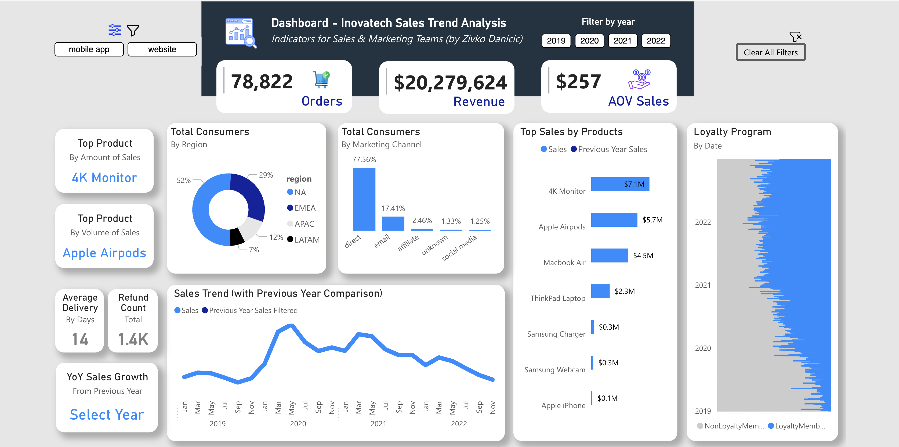

# DA-Inovatech-e-commerceAnalysis
Analytics project focused on uncovering data-driven insights for client company Inovatech. Utilizes SQL, BigQuery, Excel, PowerBI and statistical analysis.

**Overview**

The goal of this analysis is to discover data-driven insights for the client company Inovatech, a global e-commerce platform for consumer electronics. The analysis uncovers trends in sales, marketing effectiveness, product performance, customer behavior, and refund trends; providing a comprehensive view of Inovatech's performance across various areas of the business. Metrics and KPIs were tracked across multiple channels, and based on these insights, I provided recommendations on where Inovatech should focus its efforts to improve sales processes, marketing strategy, and operational efficiency.

**Data Structure, Data Cleaning & Initial Checks** 

The raw dataset contains approximately 225,000 rows and it provides customer and sales data. 

The data was pulled from BigQuery and SQL check codes to identify problems in tables can be found [here](SQL_Inovatech_Data_Checks). 

Steps taken to clean, check data quality and prepare the dataset for analytics can be found [here](Inova_Issue_Log.xlsx). 

**Exploratory Data Analysis** 

I seperated the analysis into two types: Commercial Performance Analysis and Sales Trends-Customer Behavior.

The SQL Queries with the Commercial Performance Analysis finds can be found [here](SQL_Inovatech_Commercial_Analysis).

The SQL Queries with the Sales Trends-Customer Behavior finds can be found [here](SQL_Inovatech_Sales_Trends).

The dashboard allows stakeholders to filter by year, purchase platform, region, product type, marketing channel, and customer segment (loyalty vs. non-loyalty members). It displays overall sales growth through a sales trend chart, as well as a breakdown of sales growth by product category. The complete dashboard is available in Power BI  [here](https://app.powerbi.com/view?r=eyJrIjoiMWQxYjZjMzQtOWMyOC00ZDhhLThhYjMtYzY1NTA2M2MzNWUwIiwidCI6ImE2NmM3ZDYzLWRmMWItNGYxNS05NzVmLWJlYmM2NDM1ZjZhOSJ9). 

**Business Insights**

Overall Trends:

* Inovatech recorded its highest sales volume in 2020, followed by a 9.3% decline in 2021 and a more substantial year-over-year drop of 42% in 2022. Although the number of orders increased in 2021, the average order value declined, reflecting the overall decrease in sales and indicating reduced profitability per order. Regionally, North America accounted for the largest share of sales at 52%, while Latin America contributed just 7%. The majority of sales were generated through website purchases, totaling $19.6 million, compared to only $640,000 from mobile platforms. Lastly, consumers primarily came through direct marketing channels (78%), followed by e-mail (17.4%) and affiliate and social media lagging well behind. 

Performance Measurement:

* The 27-inch 4K monitor was the best-selling product annually in all analyzed years, leading the top-selling products with 30% of total product sales each year. Meanwhile, the Apple Iphone only managed 199 orders across all analyzed years amount to a revenue of $148K, accounting for less than 1% of total product sales anually and making it a very-low performing product in terms of sales. As for marketing channels, the "direct" channel generated the highest sales and order volume in all years, followed by "email," "affiliate," and "social media." It is important to note that the email marketing channel has increasingly contributed to total sales, growing by more than 40% in 2022 compared to 2019. However, social media showed the lowest sales volume, representing only 1% of total revenue and orders, suggesting either underutilization of this strategy or an audience less inclined to convert directly through social networks.

Operational Effectiveness and Loyalty Program:

* In terms of delivery and refunds, the company maintained an average delivery time of 14 days, highlighting a significant opportunity for improvement. Across all four analyzed years, the total number of refunds was approximately 1.4K—less than 1% of total orders—indicating strong customer satisfaction or low return rates. The loyalty program also showed strong performance. In 2022, loyalty members spent approximately 19.14% more on average than non-members, contributing significantly to total sales. Their higher average order value (AOV) suggests that loyalty customers are more valuable and engaged.

**Recommendations**

Sales Performance:

* Inovatech should investigate the reasons behind the sharp decline in sales from 2021 to 2022, focusing on understanding the factors that contributed to the reduction in AOV and the decrease in total sales. Consequently, the Apple Iphone product line should be revisited, given its weak sales performance. The team should consider discontinuing it, as well as evaluating other lines that have not generated significant sales. Additionally, since the 27-inch 4K monitor has consistently been the best-selling product, the company should explore opportunities to expand this product line or introduce variants that could attract more customers.

Marketing Channels and Customer Experience:

* The efforts in social media marketing should be reevaluated, considering their low contribution to sales, indicating that the target consumer audience may not be present on these platforms. On the other hand, it is recommended to continue investing in direct marketing and email channels, as these have shown continuous growth and positive impact on sales. Email communication should be optimized to further engage customers and increase conversion rates. Furthermore, the delivery process should be investigated to understand why delivery times average 14 days. This could be significantly impacting the customer experience and Inovatech should evlaute patnerships with new logistics provides to meet the growing expectations of consumers. 

Loyalty Program:

* Given that loyalty program members have demonstrated significantly higher spending than non-members, the team recommends expanding the program's benefits, perhaps by introducing additional rewards to encourage more customers to become members. This could further help increase sales and brand loyalty.

**Next Steps: 12 Month RoadMap & Action Plan**

1. **Sales Recovery Strategy Objective**: Increase sales and customer retention after the decline in 2021 and 2022.

* Customer Segmentation: Identify segments of customers who have not made purchases in the last 12-18 months and create targeted campaigns.

* Inovatech must investigate delivery logistics to improve upon the 14 day average. This will require investigating the different logistics providers used in North American as the dominant market for sales, but as well the providers in other geographic regtions. A 2 month timeline should be allocated to tracking speed of delivery across all regions, and another 2 months should be spent acquiring new providers or improving upon the current delivery chains. 

* Exclusive Offers: Design special promotions (e.g., discounts, free shipping) for returning customers.

* Loyalty Program Enhancement: Enhance the existing loyalty program by adding tiers or offering unique rewards based on purchase history.
* Timeline: 4 months for campaign setup and launch.
* Owner: Marketing & CRM Team.

2. **Regional Expansion in LATAM Objective** : Grow market share in Latin America by leveraging low return rates and improving marketing efforts.

* Market Research: Conduct deeper research to understand customer preferences and pain points in LATAM.

* Localized Campaigns: Develop region-specific marketing campaigns with a focus on the unique cultural and consumer behaviors in LATAM.

* Customer Support: Implement localized customer service initiatives, such as a dedicated support team and local-language documentation.

* Timeline: 5 months for research, campaign creation, and support launch.

* Owner: Regional Marketing Team & Customer Support.
